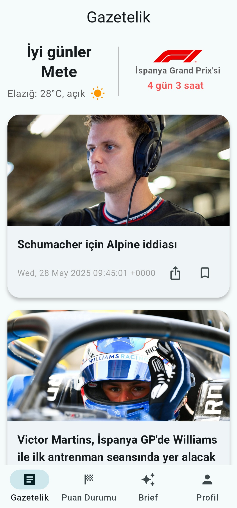
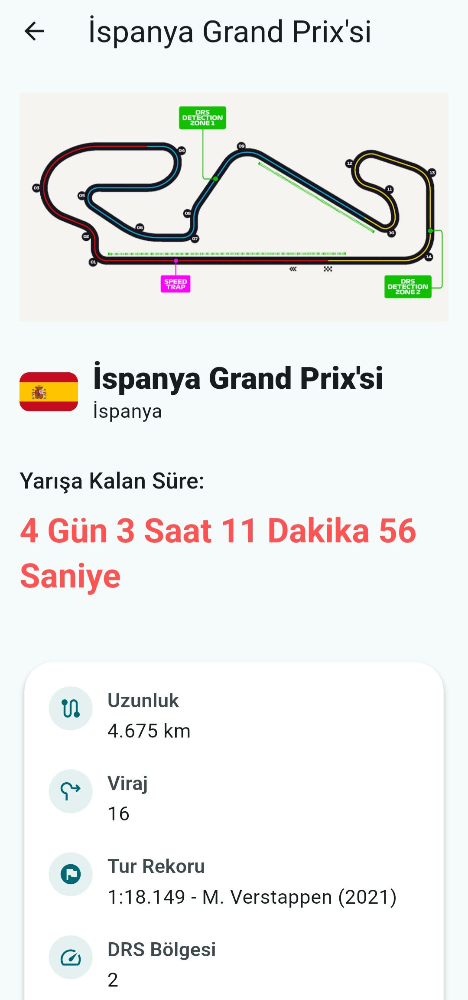
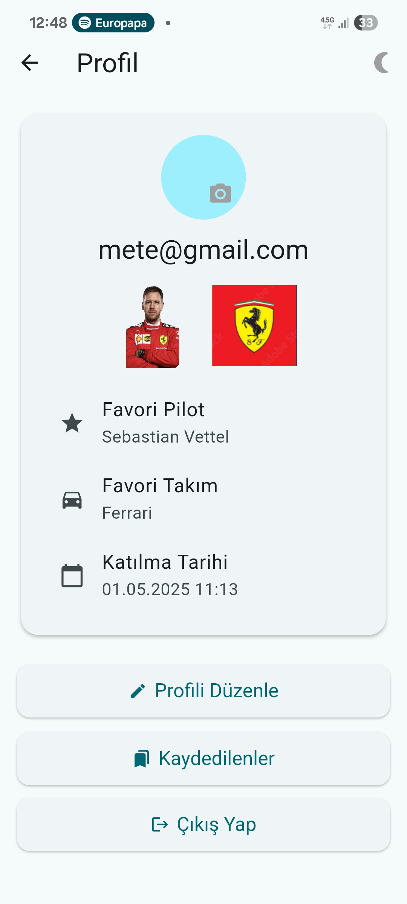
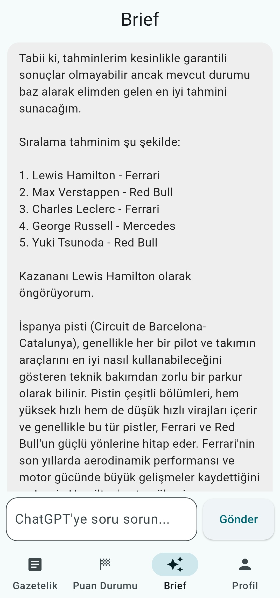
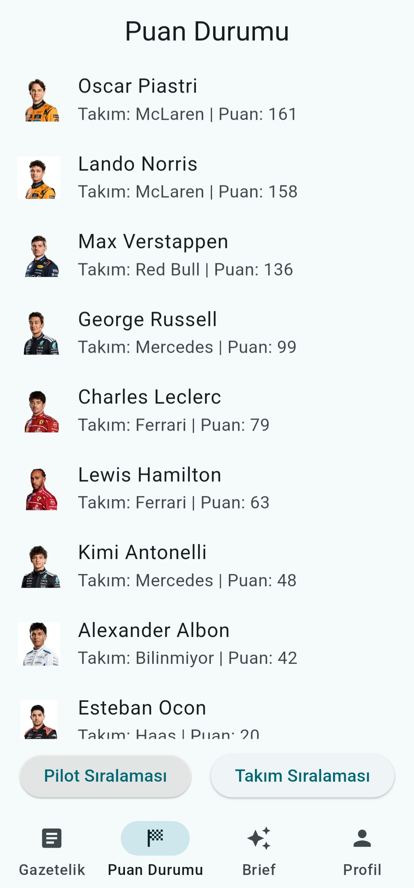
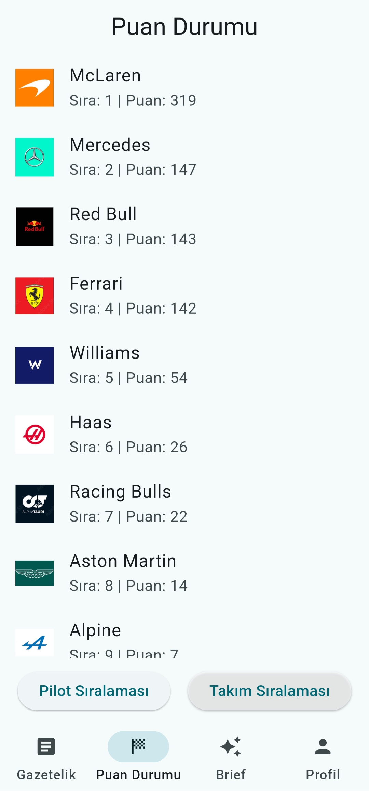

# 🏎️ FormulaBrief

**FormulaBrief**, Formula 1 meraklıları için geliştirilmiş, modern ve kullanıcı dostu bir mobil/web uygulamasıdır. Kullanıcılar uygulama üzerinden güncel F1 haberlerine ulaşabilir, pist detaylarını inceleyebilir, pilot ve takım sıralamalarını görebilir, yapay zekâ destekli analizler alabilir ve kişisel profilleri üzerinden favori haberleri takip edebilir.

---

## 🚀 Özellikler

- 📰 Güncel F1 Haberleri (motorsport.com.tr üzerinden RSS ile çekilir)
- 🏁 Pist Detayları ve Yarış Takvimi
- 📊 Pilot ve Takım Puan Durumları
- 🧠 ChatGPT Entegrasyonu ile Yapay Zekâ Sohbet
- ❤️ Haberleri Favorilere Ekleme (Kullanıcı Bazlı)
- 🔐 Giriş, Kayıt ve Profil Sayfası
- 🌐 Web & Mobil Uyumluluk

---

## 📸 Ekran Görüntüleri

<h3>Ana Ekran & Pist Detay</h3>

  
  

<h3>Profil Ekranı & Yapay Zekâ</h3>

  
  

<h3>Pilot & Takım Puan Durumu</h3>

  
  

